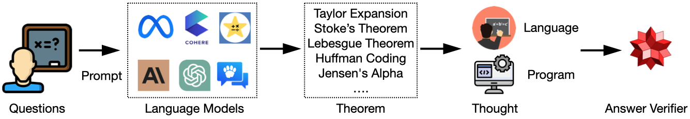
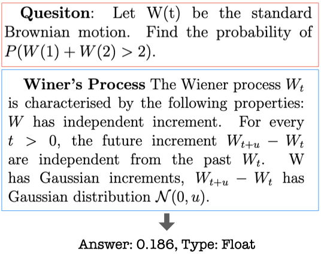

# TheoremQA
The dataset and code for paper: TheoremQA: A Theorem-driven Question Answering dataset (https://arxiv.org/abs/2305.12524). 

## Introduction
We propose the first question-answering dataset driven by STEM theorems. We annotated 800 QA pairs covering 350+ theorems spanning across Math, EE&CS, Physics and Finance. The dataset is collected by human experts with very high quality. We provide the dataset as a new benchmark to test the limit of large language models to apply theorems to solve challenging university-level questions. We provide a pipeline in the following to prompt LLMs and evaluate their outputs with WolframAlpha.
<p align="center">

</p>

The dataset covers a wide range of topics listed below:
<p align="center">

</p>

## Examples
<p align="center">

</p>

<p align="center">

</p>

## Huggingface
Our dataset is on Huggingface now: https://huggingface.co/datasets/wenhu/TheoremQA
```
from datasets import load_dataset
dataset = load_dataset("wenhu/TheoremQA")
```

## Files
- theoremqa_test.json: this file contains all the annotated question-answer pairs.
- theoremqa_visual_subset_test.json: this file contains the subset of visual questions if you want to specifically test that.
- all_theorems.json: this file contains the textual description of all the theorems being covered.
- outputs/\*.json.corrected: this folder contains all the model outputs.

Visualize the GPT-4 output in https://github.com/wenhuchen/TheoremQA/blob/main/visualize.ipynb. 

## Running Instruction

### Dependency
- openai == 0.27.6
- wolframalpha == 5.0.0
- pytorch == py3.8_cuda11.8_cudnn8.7.0_0
- sympy == 1.11.1
- transformers == 4.29.1
- accelerate == 0.19.0
- anthropic == 0.2.9


### Chain-of-Thoughts Prompting
```
python run_gpt4.py
```
This will write otuput to outputs/GPT4_s0...

### Program-of-Thoughts Prompting
```
python run_gpt4_pot.py
```
This will write otuput to outputs/GPT4_PoT_s0...


### Evaluate model output
You need to register an wolfram|alpha account to use their free API, checkout https://products.wolframalpha.com/api to register. Once you are done, you should receive an API_KEY.
```
export OPENAI_KEY=[YOUR_KEY]
export WOLFRAM_KEY=[YOUR_KEY]
python predict_accuracy.py outputs/[YOUR_FILE]
```
This will write a evaluation output as outputs/[YOUR_FILE].corrected

### Analyze the model output
```
python analyze_results.py outputs/[YOUR_FILE].corrected
```

## Leaderboard

| Model                                 | Method   | Accuracy                    |
| --------------------------------------| -------- | --------------------------- |
| GPT-4                                 | PoT      | 52.4                        |
| GPT-4                                 | CoT      | 43.8                        |
| ChatGPT                               | PoT      | 35.6                        |
| PaLM-2                                | CoT      | 31.8                        |
| ChatGPT                               | CoT      | 30.2                        |
| GPT-3.5 (text-davinci-003)            | PoT      | 27.8                        |
| Claude-v1                             | PoT      | 25.9                        |
| Claude-v1                             | CoT      | 24.9                        |
| Claude-instant                        | CoT      | 23.6                        |
| GPT-3.5 (text-davinci-003)            | CoT      | 22.8                        |
| GPT-3 (text-davinci-002)              | PoT      | 20.6                        |
| GPT-3 (text-davinci-002)              | CoT      | 16.6                        |
| Alpaca                                | CoT      | 13.5                        |
| Vicuna                                | CoT      | 12.9                        |
| Vicuna                                | CoT      | 12.9                        |
| MOSS                                  | CoT      | 12.2                        |
| StarChat                              | PoT      | 12.2                        |
| InstructCodeT5+                       | PoT      | 11.6                        |
| OpenAssistant                         | CoT      | 10.7                        |

## Cite our Work
```
@article{chen2023theoremqa,
  title={TheoremQA: A Theorem-driven Question Answering dataset},
  author={Chen, Wenhu and Ming Yin, Max Ku, Elaine Wan, Xueguang Ma, Jianyu Xu, Tony Xia, Xinyi Wang, Pan Lu},
  journal={arXiv preprint arXiv:2305.12524},
  year={2023}
}
```
